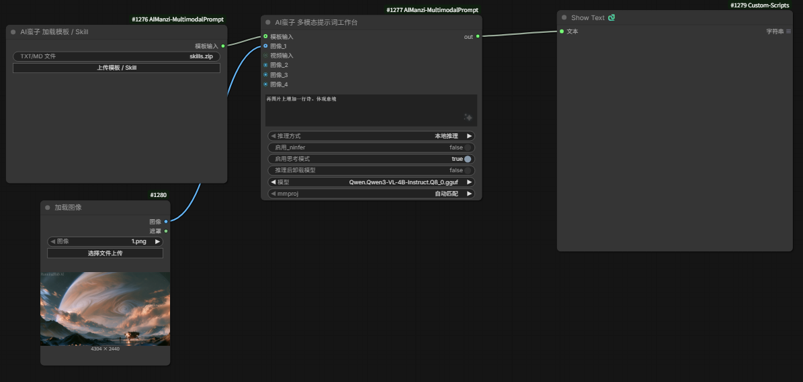
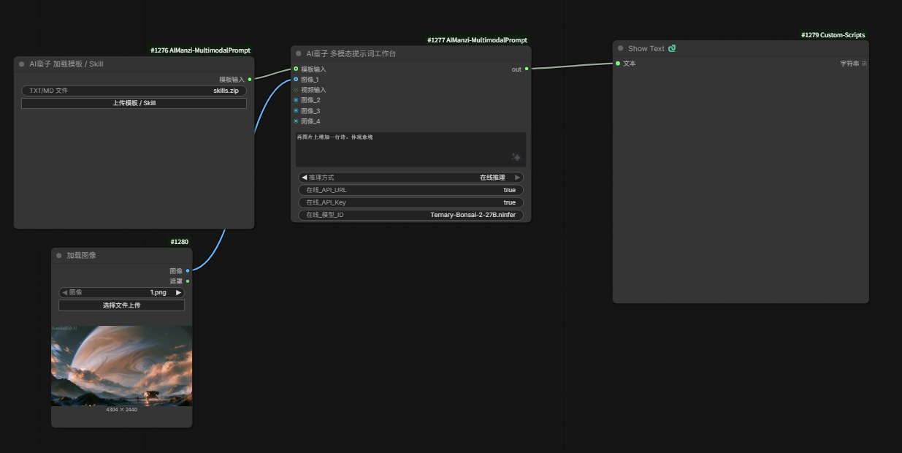

# AI蛮子多模态提示词工作台 / AIManzi Multimodal Prompt Workbench

[中文说明](#中文说明) · [English](#english)

## 下载 / Download

- **插件源码 / Source:** [GitHub Repository](https://github.com/xumanzi/ComfyUI-AIManzi-MultimodalPrompt)
- **完整插件包 / Full package:** [GitHub Releases](https://github.com/xumanzi/ComfyUI-AIManzi-MultimodalPrompt/releases/latest)
- **AI蛮子 多模态工作台插件及模型 / Plugin and models:** [夸克网盘](https://pan.quark.cn/s/be99d9acf669)

---

# 中文说明

## 插件作用

AI蛮子多模态提示词工作台是一个面向 ComfyUI 的本地与在线大语言模型提示词节点。它可以读取文字、图片、视频帧以及 TXT、Markdown、Agent Skill 模板，通过本地 NInfer、本地 GGUF 或 OpenAI 兼容在线接口生成可直接交给图像/视频模型使用的正向提示词。

默认只从 `out` 输出最终提示词纯文本，不附加标题、解释、Markdown 或思考过程；只有用户在“文字要求”中明确要求 JSON、分镜、分析过程等其他格式时才改变输出。

主要能力：

- 本地 NInfer 推理：内置 RTX 40 系（SM89）和 RTX 50 系（SM120）引擎。
- 通用 GGUF 推理：通过 ComfyUI Python 中的 `llama-cpp-python` 运行文本或视觉 GGUF。
- 在线推理：兼容 OpenAI `chat/completions` 格式的 API URL、API Key 和模型 ID。
- 多图输入：图像端口按连接顺序自动增加，最多 10 个端口；IMAGE 批次会逐张处理。
- 视频输入：从整段视频中均匀抽取最多 10 张代表帧，不修改源视频。
- 自动缩放：图片和视频帧在推理前保持比例压缩，避免超过视觉 patch 和媒体预算。
- 模板与 Skill：读取 `.txt`、`.md`、`.markdown`、`.skill` 以及包含 `SKILL.md` 的 `.zip`。
- Skill 安全解析：读取 `SKILL.md` 和 `references/` 文本，不执行 `scripts/`，不注入二进制 `assets/`，并拦截路径穿越、符号链接、加密包和异常压缩包。
- 自动上下文：根据文字、模板和媒体数量自动选择上下文；本地上限跟随运行时，最高 262144 tokens。
- 隐私输出：API Key 使用密码控件显示，模板、Skill 和完整 prompt 不输出到 ComfyUI 日志。

## 工作流截图

### 本地推理



### 在线推理



## 节点

### AI蛮子 加载模板 / Skill

上传 TXT、Markdown、`.skill` 或 Skill ZIP，解析后从“模板输入”端口连接到工作台。现有旧工作流中的 `TXT/MD 文件` 字段仍然兼容。

### AI蛮子 多模态提示词工作台

- `文字要求`：描述需要模型完成的任务。
- `推理方式`：选择“本地推理”或“在线推理”。
- `模板输入`：连接模板/Skill 加载节点。
- `图像_1 ... 图像_10`：连接图像后自动增加下一个图像端口。
- `视频输入`：连接标准 ComfyUI `VIDEO` 输出。
- `out`：最终纯文本提示词。

## 命令安装插件

### 方法一：Git + Git LFS

插件包含大体积 NInfer 引擎，克隆前必须安装 [Git LFS](https://git-lfs.com/)。在 PowerShell 中执行：

```powershell
Set-Location "你的ComfyUI目录\custom_nodes"
git lfs install
git clone https://github.com/xumanzi/ComfyUI-AIManzi-MultimodalPrompt.git
Set-Location .\ComfyUI-AIManzi-MultimodalPrompt
git lfs pull
```

更新插件：

```powershell
Set-Location "你的ComfyUI目录\custom_nodes\ComfyUI-AIManzi-MultimodalPrompt"
git pull
git lfs pull
```

### 方法二：完整压缩包

从 [GitHub Releases](https://github.com/xumanzi/ComfyUI-AIManzi-MultimodalPrompt/releases/latest) 下载 `ComfyUI-AIManzi-MultimodalPrompt-*.zip`，解压到：

```text
ComfyUI/custom_nodes/ComfyUI-AIManzi-MultimodalPrompt
```

安装或更新后必须完整重启 ComfyUI。

## 视频依赖一键安装与配置

视频输入依赖 FFmpeg 和 FFprobe。插件提供 Windows 一键脚本，会下载 FFmpeg Essentials 到插件的 `tools/ffmpeg`，自动把 `ffmpeg.exe` 的绝对路径写入 `config/settings.json`，不会修改系统 PATH。

在插件目录运行：

```powershell
powershell -NoProfile -ExecutionPolicy Bypass -File .\install_video_dependency.ps1
```

也可以从任意目录执行完整命令：

```powershell
powershell -NoProfile -ExecutionPolicy Bypass -File "你的ComfyUI目录\custom_nodes\ComfyUI-AIManzi-MultimodalPrompt\install_video_dependency.ps1"
```

脚本完成后重启 ComfyUI。若已经自行安装 FFmpeg，也可以直接编辑 `config/settings.json`：

```json
{
  "ffmpeg": "D:/ffmpeg/bin/ffmpeg.exe"
}
```

## 模型放置

模型默认扫描：

```text
ComfyUI/models/LLM
```

支持：

- `.ninfer`：仅在“启用 NInfer”时使用。
- `.gguf`：关闭 NInfer 后使用。
- 视觉 GGUF：主模型与匹配的 `mmproj*.gguf` 放在同一目录。

不支持直接加载 `.safetensors` 文本编码器或扩散模型文件。

普通 GGUF 后端需要 ComfyUI Python 中安装 `llama-cpp-python`。请使用你的 ComfyUI Python 执行：

```powershell
& "你的ComfyUI Python路径\python.exe" -m pip install -U llama-cpp-python
```

## 本地推理

### NInfer

- RTX 40 系自动使用插件内置 `engine/ninfer-sm89`。
- RTX 50 系自动使用插件内置 `engine/ninfer-sm120`。
- 30 系、20 系、AMD、Intel 和纯 CPU 设备应关闭 NInfer，使用 GGUF 或在线推理。
- NInfer 只使用插件内置引擎，不扫描电脑上的其他 NInfer 可执行文件。
- 连接图像或视频时，插件自动使用本机 Qwen3-VL/Qwen3.5 视觉 GGUF 与 mmproj 提取客观视觉事实，再交给 NInfer 生成最终提示词，避免三元转换模型视觉语义错位。
- 27B NInfer 可能需要接近独占 16GB 显存。启动前插件会卸载 ComfyUI 驻留的扩散模型、CLIP 和 VAE 并清理 CUDA 缓存，后续节点会按需重新加载。

### GGUF

- 直接调用 ComfyUI 环境中的 `llama-cpp-python`，不启动外部 llama-server。
- 当前插件配置采用通用 CPU 加载方式，NVIDIA、AMD、Intel 和纯 CPU 设备均可运行，但速度取决于 CPU 与内存。
- 图像或视频需要 Qwen3-VL/Qwen3.5 视觉 GGUF 以及匹配的 mmproj。
- 开启“推理后卸载模型”可在生成完成后释放模型内存。

## 在线推理

选择“在线推理”后，所有本地模型、NInfer、mmproj、思考和卸载选项会自动隐藏，只显示：

- `在线_API_URL`：例如 `https://api.openai.com/v1`，也可填写完整的 `.../chat/completions`。
- `在线_API_Key`：以密码形式显示；无鉴权服务可以留空。
- `在线_模型_ID`：填写服务商实际提供的模型名称。

在线模式不会加载本地 LLM，也不会占用本地 LLM 推理显存。文字、模板、Skill、图像和视频输入保持有效。服务商必须支持 OpenAI 兼容聊天接口；要发送图片或视频帧，所选在线模型还必须支持视觉输入。

> 安全提示：API Key 不会写入日志，但 ComfyUI 工作流可能保存控件值。公开分享工作流前请清空 Key。

## 输出与限制

- 默认移除 `<think>`、`<analysis>`、reasoning 区块以及最终答案之前的分析文本。
- “启用思考模式”允许本地模型内部推理，不代表把思考过程输出到 `out`。
- 插件不设置固定的 1024-token 输出上限；实际输出仍受所选模型、服务商和上下文窗口限制。
- 输入文字、Skill、图像视觉 tokens 和输出共享模型上下文。
- 在线服务的计费、内容限制、媒体大小和上下文长度由服务商决定。

---

# English

## What this plugin does

AIManzi Multimodal Prompt Workbench is a ComfyUI extension for generating production-ready image and video prompts with local or hosted large language models. It accepts text instructions, images, sampled video frames, TXT/Markdown templates, and packaged Agent Skills, then sends them to local NInfer, local GGUF, or an OpenAI-compatible online endpoint.

By default, the single `out` socket returns only the final positive prompt as plain text. Titles, explanations, Markdown, and reasoning are removed unless the user explicitly requests another format or asks to see the analysis.

Key features:

- Bundled NInfer engines for NVIDIA RTX 40-series (SM89) and RTX 50-series (SM120).
- Universal local GGUF backend powered by `llama-cpp-python`.
- OpenAI-compatible online inference with API URL, API Key, and model ID.
- Up to 10 dynamically revealed IMAGE sockets, including batched IMAGE inputs.
- VIDEO input with up to 10 representative frames sampled across the full clip.
- Automatic aspect-ratio-preserving image and video-frame resizing.
- TXT, Markdown, `.skill`, and Skill ZIP parsing.
- Safe Skill handling: reads `SKILL.md` and text references without executing scripts or loading binary assets.
- Automatic local context sizing up to 262144 tokens when supported by the runtime.
- Clean final-prompt output with hidden reasoning and no full prompt/template logging.

## Workflow screenshots

### Local inference


### Online inference


## Nodes

### AIManzi Load Template / Skill

Uploads TXT, Markdown, `.skill`, or a ZIP containing one `SKILL.md`, then exposes the parsed content through the template output.

### AIManzi Multimodal Prompt Workbench

- `文字要求`: task/instruction text.
- `推理方式`: local or online inference.
- `模板输入`: parsed template or Skill input.
- `图像_1 ... 图像_10`: dynamic image inputs.
- `视频输入`: standard ComfyUI VIDEO input.
- `out`: final prompt text.

## Command-line installation

### Git + Git LFS

The repository contains large NInfer binaries, so [Git LFS](https://git-lfs.com/) is required:

```powershell
Set-Location "path-to-ComfyUI\custom_nodes"
git lfs install
git clone https://github.com/xumanzi/ComfyUI-AIManzi-MultimodalPrompt.git
Set-Location .\ComfyUI-AIManzi-MultimodalPrompt
git lfs pull
```

To update:

```powershell
Set-Location "path-to-ComfyUI\custom_nodes\ComfyUI-AIManzi-MultimodalPrompt"
git pull
git lfs pull
```

Alternatively, download the complete ZIP from [GitHub Releases](https://github.com/xumanzi/ComfyUI-AIManzi-MultimodalPrompt/releases/latest), extract it into `ComfyUI/custom_nodes`, and restart ComfyUI.

## One-command video dependency setup

VIDEO input requires FFmpeg and FFprobe. On Windows, run the bundled installer from the plugin directory:

```powershell
powershell -NoProfile -ExecutionPolicy Bypass -File .\install_video_dependency.ps1
```

The script downloads FFmpeg Essentials into `tools/ffmpeg`, verifies both executables, and writes the absolute FFmpeg path to `config/settings.json`. It does not modify the system PATH. Restart ComfyUI afterward.

## Models

Place local models under:

```text
ComfyUI/models/LLM
```

- `.ninfer`: available when NInfer is enabled.
- `.gguf`: available when NInfer is disabled.
- Vision GGUF: keep the matching `mmproj*.gguf` beside the main model.
- `.safetensors` diffusion models and text encoders are not supported by this LLM node.

For GGUF inference, install `llama-cpp-python` into the Python environment used by ComfyUI:

```powershell
& "path-to-ComfyUI-Python\python.exe" -m pip install -U llama-cpp-python
```

## Local inference behavior

NInfer is limited to supported RTX 40/50-series GPUs. Other NVIDIA GPUs, AMD, Intel, and CPU-only systems should use GGUF or online inference. For NInfer media requests, a local Qwen3-VL/Qwen3.5 GGUF plus matching mmproj is used as a visual grounding bridge before NInfer writes the final prompt.

The GGUF backend runs inside ComfyUI through `llama-cpp-python` and currently uses a portable CPU configuration. Performance depends on CPU and system RAM.

## Online inference behavior

Selecting online inference hides every local-only control and shows:

- `在线_API_URL`: an OpenAI-compatible base URL such as `https://api.openai.com/v1`, or a complete `.../chat/completions` URL.
- `在线_API_Key`: masked in the node; may be empty for services without authentication.
- `在线_模型_ID`: the provider's actual model ID.

Online mode does not load a local LLM. Text, templates, Skills, images, and video frames remain available. The selected hosted model must support vision to accept images or video frames.

> Security: the key is not printed to logs, but ComfyUI workflows may serialize widget values. Clear the key before sharing a workflow publicly.

## Output and limits

- Reasoning blocks such as `<think>`, `<analysis>`, and common final-answer wrappers are removed by default.
- There is no plugin-enforced 1024-token output cap.
- Actual context, output length, media limits, pricing, and moderation rules depend on the selected model or API provider.
