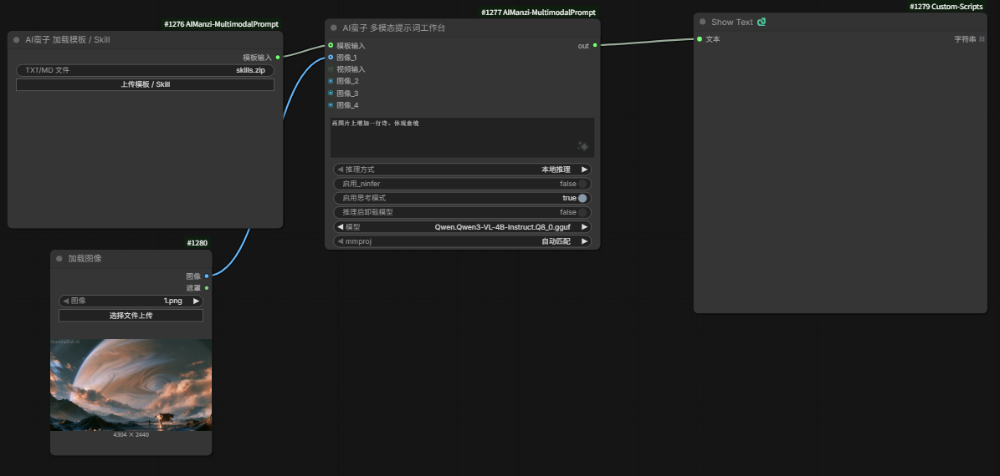
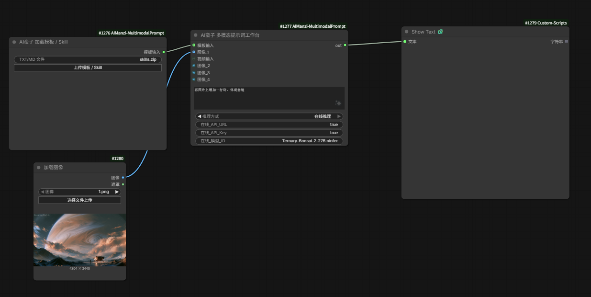

# AI蛮子多模态提示词工作台 / AIManzi Multimodal Prompt Workbench

[中文新手教程](#中文新手教程) · [English Guide](#english-guide)

把文字、图片或视频交给 AI，自动生成可以直接用于绘图、视频生成的提示词。既能使用电脑上的本地模型，也能连接 OpenAI 兼容的在线模型。

- [GitHub 完整插件包](https://github.com/xumanzi/ComfyUI-AIManzi-MultimodalPrompt/releases/latest)
- [AI蛮子多模态工作台插件及模型（夸克网盘）](https://pan.quark.cn/s/be99d9acf669)

---

# 中文新手教程

## 这个插件可以做什么？

即使你不会写提示词，也可以用这个插件完成：

- 输入一句简单要求，让模型扩写成详细的绘图提示词。
- 输入一张或多张图片，反推出画面中的人物、环境、光线、构图和风格。
- 输入视频，自动抽取代表画面并生成视频内容提示词。
- 加载 TXT、Markdown、`.skill` 或 Skill ZIP，让模型按照你的模板生成内容。
- 在“本地推理”和“在线推理”之间切换。
- 默认只从 `out` 输出最终提示词，不输出思考过程和多余说明。用户明确要求其他格式时除外。

## 效果截图

### 本地模型



### 在线模型



## 第一步：安装插件

### 方法 A：下载压缩包（最适合新手）

1. 打开 [GitHub Releases](https://github.com/xumanzi/ComfyUI-AIManzi-MultimodalPrompt/releases/latest)。
2. 下载名为 `ComfyUI-AIManzi-MultimodalPrompt-版本号.zip` 的完整插件包。
3. 解压后确认文件夹名称为 `ComfyUI-AIManzi-MultimodalPrompt`。
4. 把整个文件夹复制到：

```text
你的ComfyUI目录\custom_nodes\ComfyUI-AIManzi-MultimodalPrompt
```

5. 完全关闭 ComfyUI，然后重新启动。

> 不要把插件解压成两层同名文件夹。例如 `custom_nodes\插件名\插件名\nodes.py` 是错误的；正确位置应是 `custom_nodes\插件名\nodes.py`。

### 方法 B：使用命令安装

本仓库包含大文件，因此电脑需要先安装 [Git](https://git-scm.com/download/win) 和 [Git LFS](https://git-lfs.com/)。在 PowerShell 中运行：

```powershell
Set-Location "你的ComfyUI目录\custom_nodes"
git lfs install
git clone https://github.com/xumanzi/ComfyUI-AIManzi-MultimodalPrompt.git
Set-Location .\ComfyUI-AIManzi-MultimodalPrompt
git lfs pull
```

以后更新插件：

```powershell
Set-Location "你的ComfyUI目录\custom_nodes\ComfyUI-AIManzi-MultimodalPrompt"
git pull
git lfs pull
```

更新后重新启动 ComfyUI。

## 第二步：准备视频帧

工作台不再接收 `VIDEO` 文件对象，也不直接调用 FFmpeg。请使用 ComfyUI 的加载视频节点先把视频解码成 `IMAGE` 批次，再把它的图像输出连接到“视频”。如果加载视频节点本身提示缺少 FFmpeg，请按照该加载节点的说明安装依赖；本插件不需要单独配置 FFmpeg 路径。

```text
加载视频节点.图像/IMAGE → 工作台.视频
```

这样做可以直接使用加载节点输出的连续帧，并避免再次解码视频。

## 第三步：准备本地模型

如果只使用在线推理，可以跳过本节。

把模型文件放入：

```text
你的ComfyUI目录\models\LLM
```

支持的模型：

- `.ninfer`：仅在开启“启用 NInfer”时使用，适合支持的 RTX 40/50 系显卡。
- `.gguf`：关闭 NInfer 后使用，兼容范围更广。
- 视觉 GGUF：要识别图片或视频，主模型和匹配的 `mmproj*.gguf` 必须放在同一文件夹。

本节点不支持直接加载 `.safetensors` 扩散模型或文本编码器。

GGUF 推理还需要在 ComfyUI 自带的 Python 中安装 `llama-cpp-python`。便携版 ComfyUI 示例：

```powershell
Set-Location "你的ComfyUI目录"
& ".\python_embeded\python.exe" -m pip install -U llama-cpp-python
```

如果你的 Python 目录名称不同，请把路径替换成实际的 `python.exe`。

### GGUF 会自动使用 GPU 吗？

会。插件会自动注册 llama.cpp 的 CUDA 动态后端，运行库查找顺序为：

1. 插件自己的 `engine/llama-cuda-runtime`；
2. ComfyUI Python 已安装的 NVIDIA CUDA 13 运行库；
3. 本机 CUDA Toolkit；
4. NVIDIA 官方显卡驱动的 DriverStore。

不需要手动设置 `CUDA_PATH`，插件也不会修改 Windows 系统目录。检测到 CUDA 后会先释放
ComfyUI 暂时驻留的扩散模型显存，再根据实际可用显存自动选择：全 GPU、GPU+CPU 混合、
纯 CPU。显存不够时会尽可能把主模型层和视觉编码器保留在 GPU，CPU 只接管放不下的部分；
只有 CUDA 不可用或连续加载失败时才完全回退 CPU。ComfyUI 日志会显示运行库来源、GPU 型号、
GPU 层数、视觉编码器设备以及每次降级原因。

## 第四步：在 ComfyUI 中找到节点

启动 ComfyUI 后，在画布空白位置双击并搜索：

- `AI蛮子 多模态提示词工作台`
- `AI蛮子 加载模板 / Skill`

工作台主要选项：

| 选项 | 小白解释 |
|---|---|
| 文字要求 | 告诉 AI 你想让它做什么 |
| 推理策略 | 普通推理忠实执行；创新推理在不改变硬性要求和媒体事实的前提下主动丰富细节 |
| 随机种子 | 控制结果的随机变化；相同模型、输入、设置和固定种子可以复现结果 |
| 种子控制 | 随机、增加、减少、固定；任务入队前会计算实际种子，并立即回写到节点显示和推理请求 |
| 推理方式 | 选择本地模型或在线 API |
| 模板输入 | 连接“加载模板 / Skill”节点 |
| 图像_1 ～ 图像_10 | 连接图片；连接一个后会自动出现下一个接口 |
| 视频 | 连接加载视频节点输出的 IMAGE 批次 |
| 视频分析精度 | 快速16帧、标准64帧、高精度128帧、完整逐帧最多256帧 |
| out | 最终生成的纯文字提示词 |

### 普通推理、创新推理和种子

- 普通推理使用较低随机度，严格根据文字、模板和媒体事实生成，不主动添加未经要求的主体或情节。
- 创新推理会合理增强构图、镜头、光线、色彩、材质、环境、氛围和艺术风格，但不会修改主体身份、
  数量、指定文字或图片/视频中已经确认的事实。
- “启用思考模式”控制模型内部推理深度；“推理策略”控制最终内容的创意强度，两者互不替代。
- 图像和视频事实识别固定使用确定性种子，最终综合生成使用用户设置的主种子。
- “随机”每次入队都会生成新的 32 位种子；“增加/减少”会在入队前更新一位；“固定”保持当前数值。ComfyUI 浏览器控制台和后端日志都会显示本轮实际种子，便于核对。
- 当前版直接拦截 ComfyUI 实际使用的 API 入队调用，不再依赖部分前端版本不会触发的旧扩展钩子。创新推理还会把实际种子作为创意变化编号加入指令，使不同种子主动改变细节选择、描述顺序、构图重点和镜头表达；用户或模板明确要求固定格式时仍以该格式为准。
- 在线服务不支持 `seed` 时，插件会自动移除该参数重试一次，并在日志中提示。

## 使用示例

### 示例 1：只有文字，生成绘图提示词

连接方式：

```text
AI蛮子 多模态提示词工作台.out → Show Text
```

“文字要求”填写：

```text
生成一段东方幻想天宫场景的绘图提示词，包含云海、宫殿、金色晨光和电影级构图。
```

没有连接图片时，插件会按照文字要求直接生成提示词。

### 示例 2：图片反推提示词

连接方式：

```text
加载图像.图像 → 工作台.图像_1
工作台.out → Show Text
```

“文字要求”填写：

```text
观察图片实际内容，反推出可复现该画面的详细正向提示词。
```

可以继续连接更多图片，最多显示 10 个图像接口。图片会在发送前保持比例自动缩放，不会修改原文件。

### 示例 3：视频反推提示词

连接方式：

```text
视频加载节点.图像/IMAGE → 工作台.视频
工作台.out → Show Text
```

“文字要求”填写：

```text
根据视频中的主体、动作、镜头、环境和光线，只输出一段视频生成提示词。
```

插件按 IMAGE 批次的原始顺序读取视频。短视频会保留全部帧；长视频会同时选择覆盖完整时间线的均匀帧和画面变化明显的关键帧，再按每段最多8帧进行视觉分析，最后汇总动作、运镜、转场、场景和首尾变化。

精度建议：

- 快速：最多16帧，适合测试。
- 标准：最多64帧，适合大多数视频。
- 高精度：最多128帧，适合动作和转场较多的视频。
- 完整逐帧：视频不超过256帧时逐帧分析；更长视频会智能选择最多256帧。耗时和在线费用最高。

### 示例 4：使用模板或 Skill

连接方式：

```text
AI蛮子 加载模板 / Skill.模板输入 → 工作台.模板输入
工作台.out → Show Text
```

点击“上传模板 / Skill”，可以上传 `.txt`、`.md`、`.markdown`、`.skill` 或包含 `SKILL.md` 的 ZIP。上传完成后，加载节点会立即解析文件，并把最终结果显示在“提交给模型的内容”文本框中。这个文本框可以直接编辑；其中显示的内容就是输出连接传递并提交给模型的唯一模板内容。

TXT/MD 会保留完整正文；Skill 压缩包会按 `SKILL.md` 在前、`references` 文本资料在后的顺序合并。插件不会执行 Skill 中的脚本，也不会读取图片或其他二进制资源。多模态工作台不会再次打开文件、筛选章节、压缩、摘要或添加隐藏引用。

解析结果按文件修改时间和大小缓存；重新上传同名但内容已变化的文件会重新解析。模板会放在稳定前缀位置以便重复任务复用缓存，同时视觉观察阶段不会重复读取整份模板。控制台只显示文件名、最终字符数和短哈希，不会打印模板正文。

本地视觉事实使用最多 64 条内存 LRU 缓存。缓存键包含媒体实际内容、视频帧顺序、模型及 mmproj 文件身份、观察要求和分析参数；更换任意一项都会重新识别，不会串图或串视频。视觉观察固定使用确定性种子，不受最终生成的随机种子影响，因此只切换随机、增加、减少或固定种子时仍可复用同一份客观画面事实。切回完全相同的输入时可跳过重复视觉识别。缓存不写入磁盘，关闭 ComfyUI 后自动释放；“推理后卸载模型”只释放模型和显存，不会清除这部分普通内存缓存。

插件另保留最多 32 条完全相同请求的最终结果缓存，用于固定种子的精确复现。不同文字、模板、媒体、模型、mmproj、思考模式、推理策略、上下文或种子都会生成新键。GGUF 不再在每轮前清空 token 状态，llama.cpp 可以复用下一请求的最长共同 KV 前缀；完全相同的固定种子请求则直接返回缓存结果。在线第三方 API 不缓存最终结果，本地 NInfer API 才启用该功能。

GGUF 已加载的较大上下文可以直接服务后续较小上下文请求。例如模型已按 32768 上下文加载，再执行 8192 或 16384 请求时不会重新加载权重；只有需要更大上下文、切换模型、切换 mmproj 或切换思考处理器时才重新规划。

### 示例 5：在线推理

把“推理方式”切换为“在线推理”，然后填写：

```text
在线_API_URL：https://服务商地址/v1
在线_API_Key：服务商提供的密钥
在线_模型_ID：服务商提供的模型名称
```

在线模式不加载本地 LLM。若需要识别图片或视频，在线模型本身必须支持视觉输入。

> API Key 虽然不会打印到日志，但可能保存在 ComfyUI 工作流文件中。分享工作流前请清空 Key。

## 本地模式应该怎么选？

- RTX 40/50 系并且拥有 `.ninfer` 模型：可以打开 NInfer。
- RTX 30/20 系、AMD、Intel 或纯 CPU：关闭 NInfer，使用 GGUF，或者选择在线推理。
- 需要图片/视频识别：必须使用视觉模型。普通纯文本模型看不懂图片。
- NInfer 识别图片/视频时：插件会先用本地视觉 GGUF + mmproj 读取画面，再交给 NInfer 整理最终提示词。

## 常见问题

### 节点没有出现

检查是否出现了双层插件目录，然后查看 ComfyUI 启动窗口有没有红色报错。修正后必须完整重启 ComfyUI。

### 模型列表是空的

确认模型位于 `ComfyUI\models\LLM`，扩展名是 `.gguf` 或 `.ninfer`，然后重启 ComfyUI。

### 图片接入后仍提示上传图片

必须把“加载图像”节点的 `图像` 输出连接到工作台的 `图像_1`，不是只在文字中填写图片路径。所选模型也必须支持视觉。

### 视频报“未找到 FFmpeg”

这个错误来自负责解码视频的加载视频节点，不是本工作台。请按照该加载节点的安装说明配置 FFmpeg；确认它能够正常输出 IMAGE 批次后，再连接到“视频”。

### NInfer 启动时显存不足

27B 模型可能需要接近独占 16GB 显存。关闭其他占用显存的软件后重试；仍然无法加载时，关闭 NInfer 并改用 GGUF 或在线推理。降低上下文不能解决模型权重本身装不进显存的问题。

### 点击“中断任务”没有反应

当前版本会在 GGUF 的每次解码、图片预处理、视频选帧与分段分析、NInfer 启动等待以及在线/API
请求等待期间检查 ComfyUI 的原生中断标志。中断本地 NInfer 请求时，插件只会终止自己启动的引擎，
不会关闭用户另外启动的服务。更新插件后必须完整重启 ComfyUI，旧进程不会热加载 Python 修改。

### 怎样减少模型启动等待？

- 保持“推理后卸载模型”关闭：相同模型、思考模式和上下文容量会直接复用，不再重新读取权重。
- NInfer 上下文会按本轮实际文字、模板和视觉事实自动选择 8K、16K、32K、64K、128K 或 256K 档位；开启思考模式时最低使用 16K，避免思考过程占满 8K 后没有最终输出。
- 动态上下文采用“只升不降”的常驻复用策略：现有引擎容量足够时直接复用，不会因为下一轮输入变短而重启；只有新任务确实超过当前容量才扩容并重启一次。若模型仍因思考耗尽上下文而返回空结果，插件会自动扩大一档并重试一次。
- 当前版本会缓存GPU配置、模型列表、mmproj列表和服务模型ID；已有可用的NInfer进程时，不再重复
  调用硬件探测、扫描TCP连接或清理ComfyUI显存。
- 只有确实需要启动新的NInfer进程时，才会释放ComfyUI模型显存。启动日志会显示本次引擎实际耗时。
- 第一次加载27B NInfer仍需把大量权重从磁盘送入显存，这部分主要取决于模型所在磁盘速度；如果开启
  “推理后卸载模型”，下一次任务必然重新加载，无法获得常驻复用加速。

### 为什么输出长度不是无限的？

插件没有固定的 1024-token 输出限制，但最终长度仍受模型上下文、电脑内存/显存和在线服务商限制。输入文字、模板、图片视觉 tokens 与输出共同占用上下文。

---

# English Guide

## What does this plugin do?

AIManzi Multimodal Prompt Workbench turns text, images, videos, and reusable templates into prompts for image or video generation. It supports local NInfer, local GGUF, and OpenAI-compatible online APIs. By default, `out` returns only the final prompt as plain text.

## Beginner installation

1. Download the complete ZIP from [GitHub Releases](https://github.com/xumanzi/ComfyUI-AIManzi-MultimodalPrompt/releases/latest).
2. Extract it to `ComfyUI/custom_nodes/ComfyUI-AIManzi-MultimodalPrompt`.
3. Make sure `nodes.py` is directly inside that folder, not inside a second nested folder.
4. Restart ComfyUI.

Command-line installation requires Git and Git LFS:

```powershell
Set-Location "path-to-ComfyUI\custom_nodes"
git lfs install
git clone https://github.com/xumanzi/ComfyUI-AIManzi-MultimodalPrompt.git
Set-Location .\ComfyUI-AIManzi-MultimodalPrompt
git lfs pull
```

## Video frames

The workbench no longer accepts a `VIDEO` object and does not invoke FFmpeg. Use a ComfyUI video loader to decode the video, then connect its batched `IMAGE` output to `视频`. If that loader requires FFmpeg, follow the loader's own installation instructions.

## Local models

Place `.ninfer` and `.gguf` files in `ComfyUI/models/LLM`. A vision GGUF requires its matching `mmproj*.gguf` in the same directory. `.safetensors` diffusion models and text encoders are not supported.

Portable ComfyUI GGUF dependency example:

```powershell
Set-Location "path-to-ComfyUI"
& ".\python_embeded\python.exe" -m pip install -U llama-cpp-python
```

### Automatic GPU acceleration

The plugin automatically registers llama.cpp's dynamic CUDA backend. It searches the plugin-owned
`engine/llama-cuda-runtime` directory first, then ComfyUI's NVIDIA CUDA 13 Python runtime, the local
CUDA Toolkit, and the official NVIDIA DriverStore. It never modifies Windows system directories.

When CUDA is available, ComfyUI's idle model allocations are released before loading the GGUF.
The plugin then selects full GPU, mixed GPU+CPU, or CPU fallback from currently available VRAM.
In mixed mode, as many model layers as possible and the vision projector remain on GPU while CPU
handles the remainder. Logs report the runtime source, GPU, offloaded layer count, vision device,
and any automatic fallback.

### Inference strategy and seed

`Normal` follows the user text, template, and observed media facts conservatively. `Creative` enriches
composition, camera, lighting, color, material, atmosphere, and style while preserving all hard constraints
and visible facts. The seed uses ComfyUI's native Randomize, Increment, Decrement, and Fixed controls.
Local GGUF, NInfer, online inference, images, and chronological video segments all receive the selected seed.
If an online provider rejects the `seed` field, the plugin retries once without it and reports the fallback.

## Examples

### Text to prompt

Enter: `Create a cinematic Eastern fantasy palace prompt with clouds and golden morning light.` Connect `out` to a text display node.

### Image to prompt

Connect `Load Image → 图像_1`, then enter: `Describe the visible image as a detailed positive generation prompt.` Up to 10 image inputs can be revealed dynamically.

### Video to prompt

Connect the video loader's batched `IMAGE` output to `视频`, then enter: `Describe the subjects, motion, camera, environment, and lighting as one video prompt.` Frames remain chronological. Depending on the selected precision, the workbench uses up to 16, 64, 128, or 256 frames, combines uniform timeline coverage with scene-change frames, analyzes chunks of up to eight frames, and synthesizes one final prompt.

### Online inference

Choose online inference and enter the provider's API URL, API key, and model ID. The hosted model must support vision if images or videos are connected. Clear the API key before sharing a workflow because widget values may be serialized.

## Hardware notes

- NInfer is for supported RTX 40/50-series GPUs.
- RTX 30/20-series, AMD, Intel, and CPU-only systems should use GGUF or online inference.
- Local image/video understanding requires a compatible vision GGUF plus mmproj.
- The plugin removes common reasoning blocks by default and does not impose a fixed 1024-token output cap; runtime and provider limits still apply.
- ComfyUI's Interrupt button is polled during GGUF decoding, media preprocessing, video segment analysis,
  local-engine startup, and API waits. Cancelling a local request terminates only an engine owned by this plugin.
- Leave `Unload model after inference` disabled for the fastest repeated requests. Hardware discovery, model/mmproj
  scans, service model IDs, and compatible resident engines are cached; ComfyUI VRAM is released only when a new
  NInfer process really has to start.
